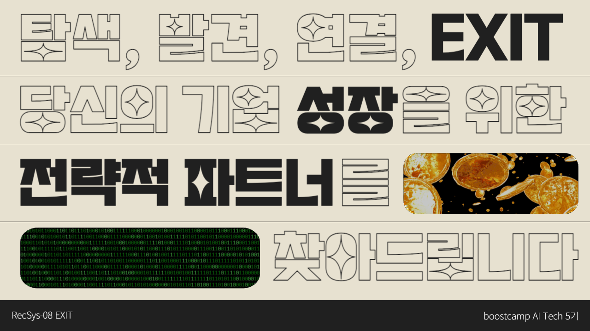

# 특허 기반 전략적 기업 파트너 추천

## 📍 Introduction
기술적 성장을 도모하는 기업의 사업자 번호를 입력받아 특허 정보를 이용해 전략적 파트너 기업을 추천하는 프로젝트
  

## 📺 Presentation

  

사진을 클릭하시면, 발표 영상을 확인하실 수 있습니다.
  

## 👼 Member
<table align="center">
  <tr height="155px">
    <td align="center" width="160px" height="155px">
      
    </td>
    <td align="center" width="160px" height="155px">
      
    </td>
    <td align="center" width="160px" height="155px">
      
    </td>
    <td align="center" width="160px" height="155px">
      
    </td>
    <td align="center" width="160px" height="155px">
      
    </td>
  </tr>
  <tr height="80px">
    <td align="center" width="160px">
      <a href="https://github.com/rlawldn11703">김지우_T5063</a>
    </td>
    <td align="center" width="160px">
      <a href="https://github.com/Sh-IT0311">박수현_T5085</a>
    </td>
    <td align="center" width="160px">
      <a href="https://github.com/rimmiya">석예림_T5110</a>
    </td>
    <td align="center" width="160px">
      <a href="https://github.com/AI-soyoung">임소영_T5172</a>
    </td>
    <td align="center" width="160px">
      <a href="https://github.com/1132jjw">전증원_T5185</a>
    </td>
  </tr>
  <tr height="140px">
    <td align="center" width="160px">
      데이터 크롤링 및 전처리, Top-K Recommendation
    </td>
    <td align="center" width="160px">
      Product Manager, Business Embedding, Inference Server 개발
    </td>
    <td align="center" width="160px">
      데이터 크롤링 및 전처리, Top-K Recommendation
    </td>
    <td align="center" width="160px">
      프로젝트 기획 및 제안, Enterprise Valuation, Streamlit 개발
    </td>
    <td align="center" width="160px">
      Enterprise Valuation, Database 구축
    </td>
  </tr>
</table>
&nbsp;
  

🛠️ Experiment & Tools
---
* (팀 구성 및 컴퓨팅 환경) 5인 1팀, 인당 V100 서버를 VSCode와 SSH로 연결하여 사용
* (협업 환경) GitHub, Notion
* (의사 소통) Slack, Zoom
  

🗂️ DB Structure
---
 

  

  

## 🚨 Service Pipeline

  

1. User와 상호작용하는 웹의 경우, Streamlit 으로 구현하였고, 이를 Dockerize 하여 GCP의 Cloud Run을 통해 배포
2. 데이터의 경우, GCP의 CloudSQL에서 제공하는 MySQL 데이터베이스와 Google Cloud Storage를 통해 관리
3. Inference의 경우, GPU 및 대용량 램을 활용할 수 있도록 Inference는 V100 서버에서 이루어졌으며 해당 과정에서 소켓 통신을 활용
  

## 📍 Model Pipeline

  

1. Business Embedding : 특허 데이터와 기업 업종 데이터를 이용하여 각 기업의 기술력을 임베딩 벡터로 표현 및 벡터간의 유사성을 고려하여 기술적으로 유사한 기업들을 매핑
2. Enterprise Valuation : 시장 내 기업의 상대적 위치를 파악 및 기술의 유효성을 정량평가할 수 있는 지표인 기업 가치를 예측
3. Top-K Recommendation : 의뢰기업의 특허 데이터를 기반으로 전략적 파트너 기업을 추천
  

## 💻 Project Report
[Wrap-Up Report Link](https://github.com/boostcampaitech5/level3_recsys_finalproject-recsys-08/blob/main/docs/%5BRecsys%208%E1%84%8C%E1%85%A9%20EXIT%5D%20Final%20Project%20Wrap%20Up%20Report.pdf)
